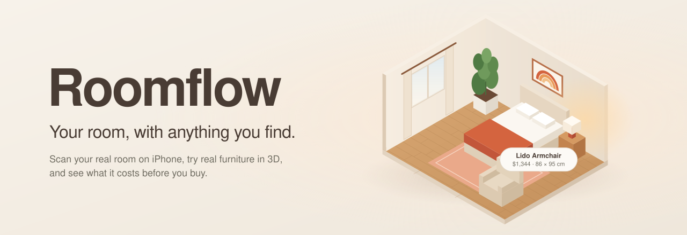
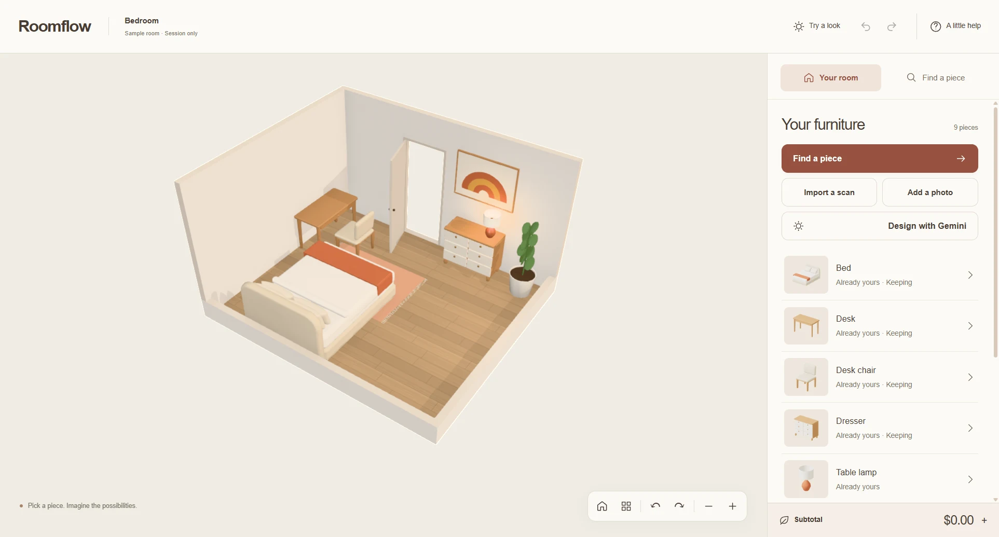
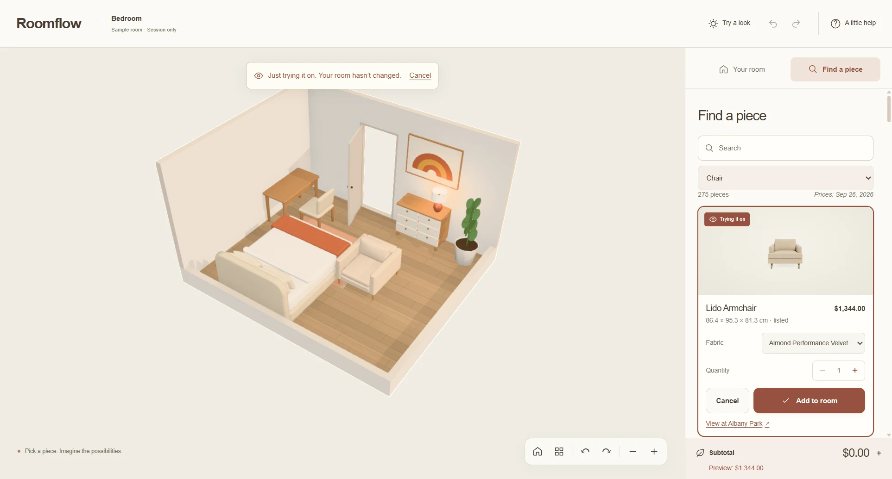
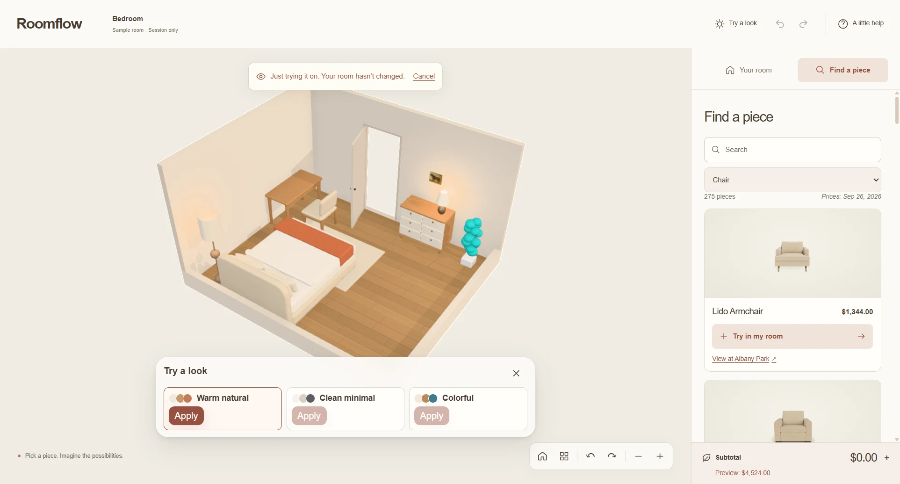
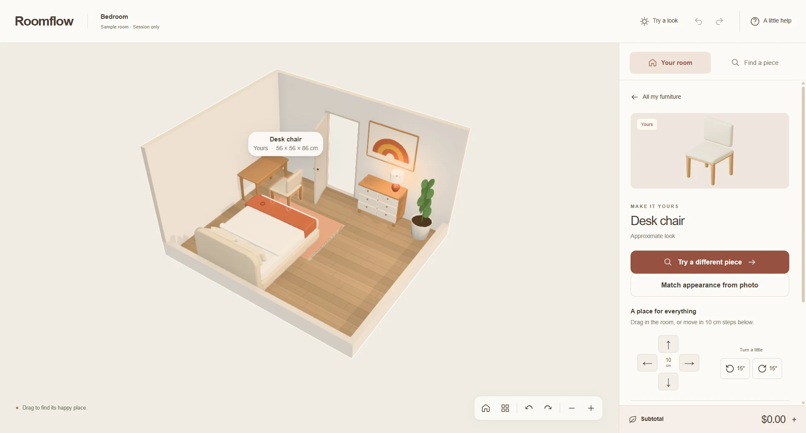

<p align="center">
  
</p>

<p align="center">
  <b>Scan your real room. Try real furniture in it. See what it costs before you buy.</b>
</p>

<p align="center">
  <a href="#quick-start">Quick start</a> ·
  <a href="#how-it-works">How it works</a> ·
  <a href="#features">Features</a> ·
  <a href="#using-roomflow">Using Roomflow</a> ·
  <a href="#project-layout">Project layout</a>
</p>

---

Roomflow turns the room you're standing in into an editable 3D miniature, then lets you shop inside it. Scan with an iPhone, open the scan in the browser, and try on different versions of the room: swap the chair, test a whole new look, drag the bed under the window. Every piece stays at its real size, every price comes from a real store, and nothing changes until you say so.

<p align="center">
  
</p>

## How it works

```
 iPhone (Swift · RoomPlan)                Browser (React · Three.js)
┌──────────────────────────┐   .json /   ┌────────────────────────────────────┐
│ Scan walls, doors,       │   .zip      │ Import & validate ─► editable room │
│ windows and furniture    │ ──────────► │        │                           │
│ + reference photos       │   share     │        ▼                           │
│ + wall art, colors       │             │ 3D scene ◄── furniture recipes     │
└──────────────────────────┘             │        │         ▲                 │
                                         │        ▼         │                 │
                                         │ Try ─► Apply ─► subtotal & undo    │
                                         │                  │                 │
                                         │     2,246 products from 17 stores  │
                                         └────────────────────────────────────┘
```

1. **Capture.** The iOS app uses Apple's RoomPlan to measure walls, doors, windows and furniture. It also saves reference photos, estimated colors and wall art, and can scan a single piece of furniture.
2. **Bring it over.** Share the scan as a RoomPlan `.json` or a Roomflow `.zip` package, then choose **Open my scan** in the browser. Every file is validated at the boundary; malformed geometry is rejected rather than guessed at.
3. **Rebuild the room.** The scan becomes an editable room in meters (right-handed, Y-up). Doors stay open, windows stay where they were, and your furniture keeps its measured size.
4. **Draw it.** Each piece is built from a parametric *recipe*: a small set of shapes sized to the product's listed dimensions and colored from its photos. The result reads as a clean architectural miniature.
5. **Shop in place.** Products come from a snapshot of 17 stores' public catalogs. Trying a piece is a preview; only **Add to room** changes the room, the purchase list and the subtotal together, and one undo reverses both.

## Features

<table>
  <tr>
    <td width="50%"></td>
    <td width="50%"></td>
  </tr>
  <tr>
    <td><b>Try a piece.</b> Search 2,246 real products, pick a fabric or finish, and see it in your room at its real size. The preview subtotal is separate until you add it.</td>
    <td><b>Try a look.</b> Preview a coordinated style — Warm natural, Clean minimal or Colorful — across the room from the same camera angle, then apply or cancel.</td>
  </tr>
</table>

- **Your room, measured.** Import an iPhone RoomPlan scan or a Roomflow package, with walls, openings, furniture, colors and wall art.
- **Direct editing.** Drag furniture across the floor, slide paintings along their wall, rotate with the handle or `R`, nudge in 10 cm steps. Overlaps and blocked windows are caught before they're committed.
- **Keep and lock.** *Keep* protects a piece from being replaced by a new design; *lock* also pins its position and rotation.
- **Honest prices.** Money is stored in integer cents with its currency. Unknown prices stay unknown, never $0, and furniture you already own adds nothing to the subtotal. Each product links to its store, with the date its price was read.
- **Undo everything.** Moves, swaps and looks all undo and redo, spatial and financial effects together.
- **Add from a photo** *(optional)*. Photograph something you found in a shop; Gemini recognizes what it is, you enter its size (marked as your estimate or as measured), and an approximate version goes into your room.
- **Design with Gemini** *(optional)*. Describe a change ("warmer, under $600, keep my bed") and review Gemini's plan as a preview before applying it. Every suggestion is checked by deterministic code for budget, keeps, locks and room bounds.
- **Match appearance from photo** *(optional)*. Recolor one of your pieces to match a photo, without changing its size or placement.

<p align="center">
  
</p>

## Quick start

**Browser app** (Node 24 recommended):

```bash
cd web
npm ci
npm run dev
```

Open the printed local URL and choose **Explore sample room**, or **Open my scan** to load a RoomPlan `.json` or Roomflow `.zip` file. Two sample scans live in `web/src/fixtures/`.

**Optional AI features.** Copy `web/.env.example` to `web/.env.local` and set `GEMINI_API_KEY`. The key is read only by the local server and never reaches the browser. Spending is capped per call and per day (`AI_CALL_CAP_USD`, `AI_DAILY_CAP_USD`). Without a key, the room, catalog, looks and editing all work; the photo and Gemini features say they aren't configured.

**iOS capture app** (Xcode, iOS 17+, a LiDAR iPhone for real scans):

```bash
open ios/RoomFlow.xcodeproj
```

Simulator builds compile and run the tests, but room capture needs a physical device with LiDAR.

## Using Roomflow

| To… | Do this |
| --- | --- |
| Look around | Drag an empty part of the room to orbit; scroll to zoom. The view bar has reset, top-down, orbit and zoom buttons. |
| Select a piece | Click it in the room, or pick it from **Your room**. |
| Move it | Drag it across the floor, or use the arrows in its details. Paintings slide along their wall. |
| Rotate it | Drag the rotate handle, press `R`, or use the 15° buttons. Hold `Shift` while dragging to snap in 15° steps. |
| Replace it | **Try a different piece** → choose a product → **Add to room**, or **Cancel**. |
| Add something new | **Find a piece**, search or filter by category, then **Try in my room**. |
| Restyle the room | **Try a look** → preview a style → **Apply**. |
| Undo / redo | `Ctrl`/`⌘` + `Z` · `Ctrl` + `Y` or `⌘` + `Shift` + `Z` |
| Remove a piece | Select it and press `Delete`. |
| Back out of anything | `Esc` cancels a preview or clears the selection. |

Designs live in the current browser session; reloading the page starts fresh.

## Project layout

```
roomflow/
├── ios/                 Swift capture app (RoomPlan, photos, wall art, piece scans, export)
├── web/
│   ├── src/
│   │   ├── domain/      Pure rules: schema, geometry, money, commands, undo, looks
│   │   ├── import/      RoomPlan and .roomflow.zip import with validation
│   │   ├── scene/       Three.js / React Three Fiber room, camera and interaction
│   │   ├── blocks/      Parametric furniture recipes
│   │   ├── catalog/     Product snapshot, search and price refresh
│   │   ├── roomDesigner/, recognition/   Optional Gemini features
│   │   └── ui/          Panels, dialogs and editor actions
│   ├── server/          Local-only API: Gemini calls, price refresh, spend caps
│   └── public/catalog/  Product snapshot and furniture recipes
├── docs/                Architecture, decisions, file formats, changelog
└── spec.md              Product specification
```

**Stack:** React 19, TypeScript, Three.js with React Three Fiber and Drei, Zustand, Zod, Tailwind, Vite and Vitest on the web; Swift, SwiftUI and RoomPlan on iOS.

**Checks** (from `web/`): `npm run typecheck`, `npm run lint`, `npm test`, `npm run build`. CI runs them on every push.

More detail: [`docs/ARCHITECTURE.md`](docs/ARCHITECTURE.md) describes every file, [`docs/DECISIONS.md`](docs/DECISIONS.md) records the tradeoffs, [`docs/ios-room-package.md`](docs/ios-room-package.md) and [`docs/room-json.md`](docs/room-json.md) define the file formats, and [`spec.md`](spec.md) is the full product spec.

## Honest limits

- Furniture models are stylized to match a product's size, shape and color, not photoreal replicas.
- A photo of an item found in person gives an approximate preview. One photo can't establish size, so fit conclusions rely on the dimensions you enter.
- Prices are from a catalog snapshot taken September 26, 2026. Refreshing a price re-reads it from the store.
- The footprint check doesn't prove a piece fits through a door or up a stairwell.
- AI features run through a local development server and are not set up for public hosting.

## Team

Built by **Yash Singh** (web app) and **Keshav Tyagi** (iOS capture).
